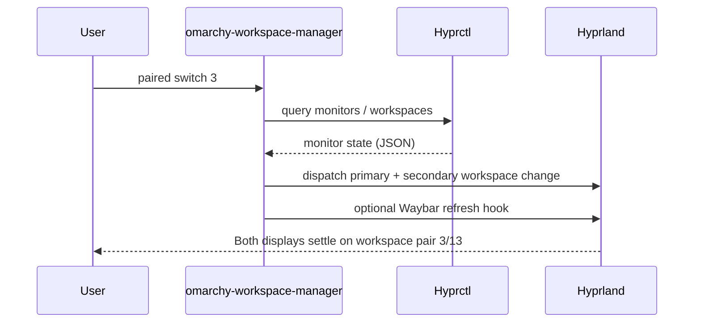

<div align="center">
  <h1>Omarchy Workspace Manager</h1>
  <p>Hyprland’s companion for perfectly paired dual-monitor workspaces.</p>
  <p>
    <a href="./version"></a>
    <a href="https://omarchy.org/"></a>
    <a href="#installation"></a>
    <a href="#uninstall"></a>
  </p>
</div>

---

## Table of Contents
- [At a Glance](#at-a-glance)
- [Installation](#installation)
- [Quick Start](#quick-start)
- [Default Keybinds](#default-keybinds)
- [Feature Overview](#feature-overview)
- [How It Works](#how-it-works)
- [Requirements](#requirements)
- [Configuration](#configuration)
  - [Sample Pairing Config](#sample-pairing-config)
- [Uninstall](#uninstall)
- [Resources](#resources)

## At a Glance

| 🎯 Goal | 🔧 What You Get | ⚡ Why It Matters |
| --- | --- | --- |
| Keep primary and secondary monitors locked to the same workspace index | A CLI toolkit that monitors Hyprland state, repairs drift, and generates Hyprland fragments | Instant parity across displays, fewer manual workspace hops, and resilient layouts after sleep or hot-plug events |

## Installation

One-step install:
```bash
curl -fsSL https://raw.githubusercontent.com/jtaw5649/omarchy-workspace-manager/master/install.sh | bash
```

Alternatively, clone and install:
```bash
git clone https://github.com/jtaw5649/omarchy-workspace-manager.git
cd omarchy-workspace-manager
./install.sh
```

Set `OWM_INSTALL_DEST`, `OWM_INSTALL_BIN_DIR`, or `OWM_INSTALL_CONFIG_DIR` beforehand if you want alternate locations.

The installer automatically:
- stages the toolkit under `${OWM_INSTALL_DEST:-$HOME/.local/share/omarchy-workspace-manager}` with a `current` symlink
- drops `${OWM_INSTALL_BIN_DIR:-$HOME/.local/bin}/omarchy-workspace-manager` so the CLI is ready on your `PATH`
- generates Hyprland fragments in `${OWM_INSTALL_CONFIG_DIR:-$HOME/.config/omarchy-workspace-manager}` and sources them from `hyprland.conf`
- detects connected monitors via `hyprctl` to seed `config/paired.json`, reloads Hyprland, and restarts the daemon

## Quick Start

1. **Run the installer.** Use the curl command above or `./install.sh` from the clone. The script stages binaries, seeds `paired.json`, generates Hyprland fragments, and integrates them into your config.
2. **Confirm your `PATH`.** Ensure `${OWM_INSTALL_BIN_DIR:-$HOME/.local/bin}` is exported so `omarchy-workspace-manager` resolves in new shells.
3. **Test the pairing.** Execute `omarchy-workspace-manager paired switch 3` and watch both monitors jump together. If the auto-detected layout needs tweaks, adjust `config/paired.json` and rerun `omarchy-workspace-manager setup install --yes`.
> [!TIP]
> To change the install destination: re-run the installer with updated `OWM_INSTALL_DEST`, `OWM_INSTALL_BIN_DIR`, or `OWM_INSTALL_CONFIG_DIR` values—existing fragments will be regenerated in the new locations.

## Default Keybinds

The installer renders Hyprland bindings that keep the number row mapped to paired workspaces (keycodes `code:10`–`code:19` map to `1`–`0`).

| Shortcut | Action |
| --- | --- |
| `Super+1…0` | Focus paired workspace (1–10) on both monitors |
| `Super+Shift+1…0` | Move the focused window to the paired workspace (1–10) |
| `Super+Shift+Arrow keys` | Move the focused window in the pressed direction (supports crossing monitors) |
| `Super+Scroll Up` | Cycle to the previous paired workspace |
| `Super+Scroll Down` | Cycle to the next paired workspace |

## Feature Overview

| 🚦 Dry-Run Guardrails | 🧠 Auto Awareness | 🛠️ Configurable |
| --- | --- | --- |
| `dispatch --dry-run` previews fixes before applying them so layout changes stay auditable. | `daemon` listens to Hyprland events, rebalancing whenever monitors appear, sleep, or change DPMS state. | Customize pairings, offsets, and generated fragments with `setup install` and environment overrides. |

## How It Works



## Requirements
- Hyprland
- `curl` (or `wget`), `bash`, `jq`, `tar`, `pgrep`

## Configuration
- **Monitors:** Edit `config/paired.json` to map the logical workspace pairing for your monitor names.
- **Install destinations:** Export `OWM_INSTALL_DEST`, `OWM_INSTALL_BIN_DIR`, or `OWM_INSTALL_CONFIG_DIR` to change where the installer writes binaries and fragments.
- **Keybinds:** Regenerate bindings with `omarchy-workspace-manager setup install --yes` after editing `config/hypr-bindings.conf` so Hyprland picks up the changes.

### Sample Pairing Config

```json
{
  "primary_monitor": "DP-1",
  "secondary_monitor": "DP-2",
  "paired_offset": 10,
  "workspace_groups": {
    "primary": [1, 2, 3, 4, 5, 6, 7, 8, 9, 10],
    "secondary": [11, 12, 13, 14, 15, 16, 17, 18, 19, 20]
  }
}
```
> [!NOTE]
> The installer regenerates this file using `hyprctl monitors` output. Manual edits are preserved if you skip regeneration (`OWM_INSTALL_SKIP_HYPR_RELOAD=1`) or re-run `setup install` after applying changes.

## Uninstall

Option 1: Run `omarchy-workspace-manager uninstall` to remove the CLI wrapper, staged versions, and generated Hyprland fragments.

Option 2: Execute `scripts/uninstall.sh`, which honours the same environment overrides and performs the same cleanup.

## Resources
- [Hyprland Documentation](https://wiki.hyprland.org/) — Reference for integrating the generated fragments into your config.
- [Omarchy Desktop Ecosystem](https://omarchy.org/) — Learn more about Omarchy.
- [Omarchy GitHub Organization](https://github.com/basecamp/omarchy) — Explore Omarchy configuration.
