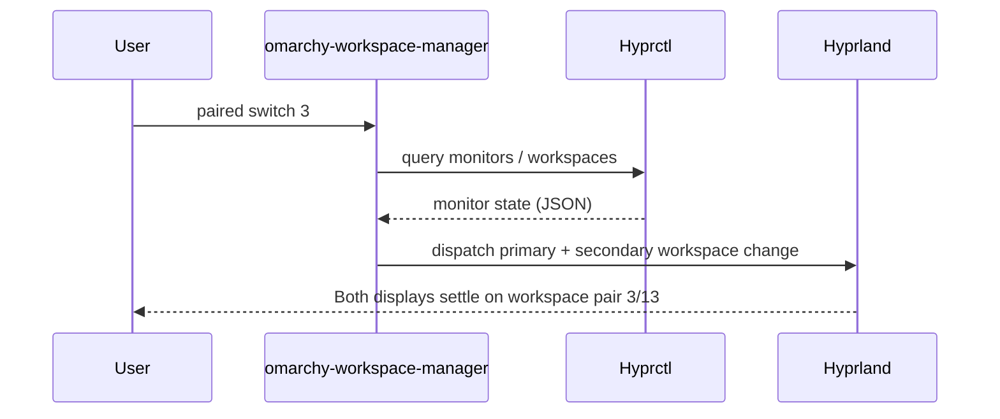

<div align="center">
  <h1>Omarchy Workspace Manager</h1>
  <p>Hyprland's companion for perfectly paired dual-monitor workspaces.</p>
  <p>
    <a href="./PKGBUILD"></a>
    <a href="https://omarchy.org/"></a>
    <a href="https://aur.archlinux.org/packages/omarchy-workspace-manager"></a>
  </p>
</div>

---

## Table of Contents
- [At a Glance](#at-a-glance)
- [Installation](#installation)
- [Quick Start](#quick-start)
- [Default Keybinds](#default-keybinds)
- [Feature Overview](#feature-overview)
- [How It Works](#how-it-works)
- [Requirements](#requirements)
- [Configuration](#configuration)
  - [Sample Pairing Config](#sample-pairing-config)
- [Waybar Integration](#waybar-integration)
- [Uninstall](#uninstall)
- [Resources](#resources)

## At a Glance

| 🎯 Goal | 🔧 What You Get | ⚡ Why It Matters |
| --- | --- | --- |
| Keep primary and secondary monitors locked to the same workspace index | A CLI toolkit that monitors Hyprland state, repairs drift, and generates Hyprland fragments | Instant parity across displays, fewer manual workspace hops, and resilient layouts after sleep or hot-plug events |

## Installation

Install from the AUR:
```bash
yay -S omarchy-workspace-manager
```

Config auto-generates on first use—monitors are detected via `hyprctl` and Hyprland fragments are sourced automatically.

## Quick Start

1. **Install the package.** Use the AUR command above.
2. **Run any command.** The first invocation auto-detects monitors, generates `paired.json`, creates Hyprland fragments, and sources them into your config.
3. **Test the pairing.** Execute `omarchy-workspace-manager paired switch 3` and watch both monitors jump together. If the auto-detected layout needs tweaks, adjust `~/.config/omarchy-workspace-manager/paired.json` and rerun `omarchy-workspace-manager setup install`.

> [!TIP]
> The daemon starts automatically via the generated `autostart.conf`. It listens for monitor hotplug events to keep workspaces paired.

## Default Keybinds

The setup generates Hyprland bindings that keep the number row mapped to paired workspaces (keycodes `code:10`–`code:19` map to `1`–`0`).

| Shortcut | Action |
| --- | --- |
| `Super+1…0` | Focus paired workspace (1–10) on both monitors |
| `Super+Shift+1…0` | Move the focused window to the paired workspace (1–10) |
| `Super+Scroll Up` | Cycle to the previous paired workspace |
| `Super+Scroll Down` | Cycle to the next paired workspace |

## Feature Overview

| 🧠 Auto Awareness | 🛠️ Configurable |
| --- | --- |
| `daemon` listens to Hyprland events, rebalancing whenever monitors appear or are removed. | Customize pairings and offsets in `paired.json`, regenerate fragments with `setup install`. |

## How It Works



## Requirements
- Hyprland
- `jq`, `socat`

## Configuration
- **Monitors:** Edit `~/.config/omarchy-workspace-manager/paired.json` to map the logical workspace pairing for your monitor names.
- **Keybinds:** Regenerate bindings with `omarchy-workspace-manager setup install` after editing preferences.

### Sample Pairing Config

```json
{
  "primary_monitor": "DP-1",
  "secondary_monitor": "DP-2",
  "paired_offset": 10
}
```

> [!NOTE]
> On first run, this file is auto-generated using `hyprctl monitors` output. Monitors are sorted by x-position to determine primary (left) and secondary (right). The `paired_offset` determines how many workspaces per monitor (default 10), so workspace 3 on primary pairs with workspace 13 on secondary.

## Waybar Integration

Add a custom module to your Waybar config:

```json
"custom/workspaces": {
    "exec": "omarchy-workspace-manager waybar",
    "return-type": "json",
    "format": "{}",
    "on-scroll-up": "omarchy-workspace-manager paired cycle prev",
    "on-scroll-down": "omarchy-workspace-manager paired cycle next"
}
```

The module displays workspaces 1-5 with inline pango styling:

| State | Display |
|-------|---------|
| Active + has windows | bright square (`#ffffff`) |
| Active + empty | dim square (`#666666`) |
| Inactive + has windows | mid-bright number (`#aaaaaa`) |
| Inactive + empty | dim number (`#666666`) |

Scroll to cycle between paired workspaces.

## Uninstall

```bash
yay -R omarchy-workspace-manager
```

Config cleanup is automatic—the package runs `setup uninstall` on removal, which removes source refs from your Hyprland configs.

**Optional manual cleanup:**
- Remove user config: `rm -rf ~/.config/omarchy-workspace-manager`
- If you added the Waybar module, remove the `custom/workspaces` entry from your Waybar config

## Resources
- [Hyprland Documentation](https://wiki.hyprland.org/) — Reference for integrating the generated fragments into your config.
- [Omarchy Desktop Ecosystem](https://omarchy.org/) — Learn more about Omarchy.
- [Omarchy GitHub Organization](https://github.com/basecamp/omarchy) — Explore Omarchy configuration.
